# **AHJ-Diploma: Chaos Organizer**
  
[Frontend](https://lap-dmitry.github.io/AHJ-diploma-Chaos-front/)  
[Backend](https://lap-heroku-chaos.herokuapp.com/)  

## **Обязательные для реализации функции**
1. **Сохранение в истории ссылок и текстовых сообщений**
   * Для сохранения сообщений, нужно его вписать в поле ввода и нажать кнопку "Enter" или иконку для отправки сообщения  
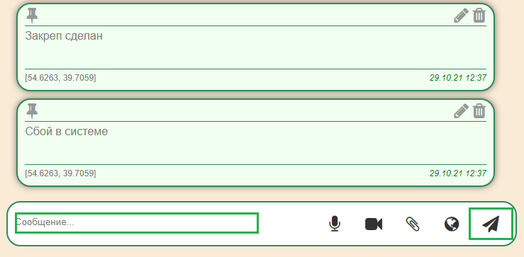
2. **Ссылки (то, что начинается с http:// или https://) должны быть кликабельны и отображаться как ссылки**  
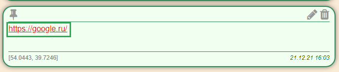
3. **Сохранение в истории изображений, видео и аудио (как файлов)**
   * через Drag & Drop  
 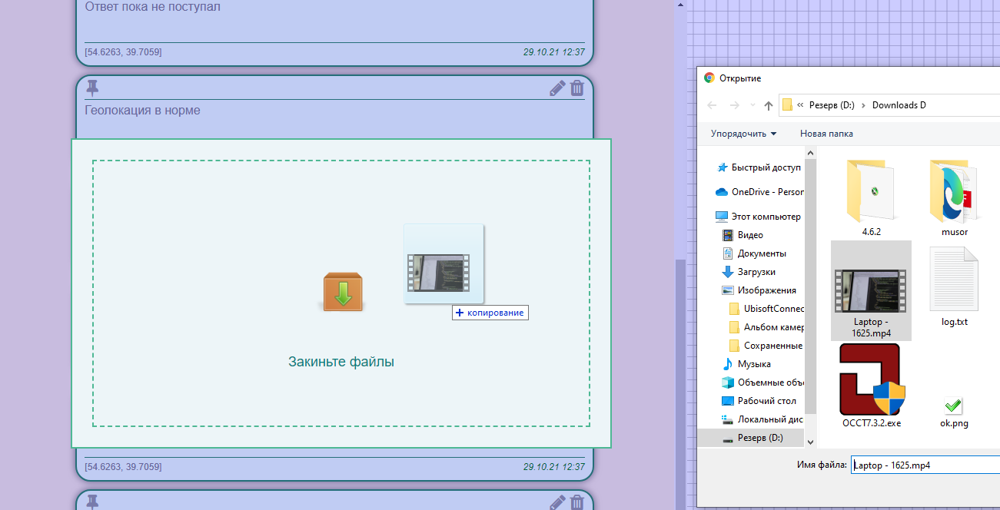
   * через иконку загрузки (скрепка в большинстве мессенджеров)  
 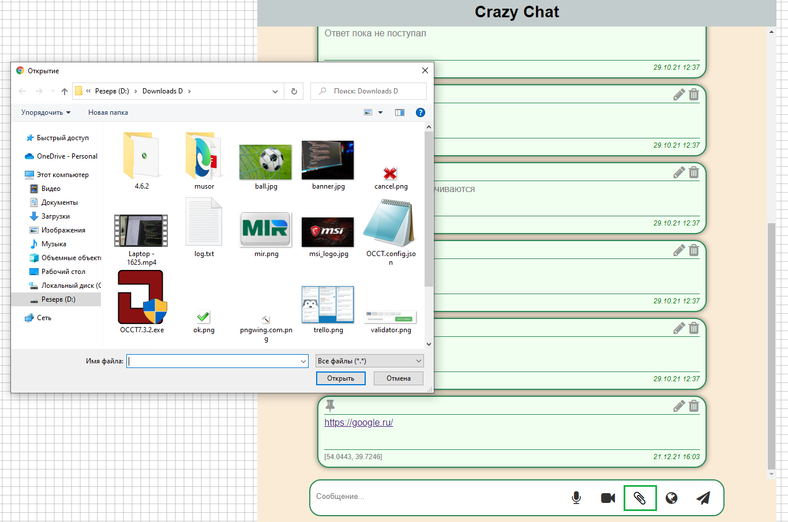
4. **Скачивание файлов (на компьютер пользователя)**  
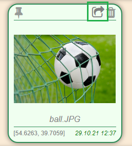
5. **Ленивая подгрузка: сначала подгружаются последние 10 сообщений, при прокрутке вверх подгружаются следующие 10 и т.д.**
   *  При 10 сообщений и боллее, нужно листнуть вверх для подгрузки остальных сообщений 

## **Дополнительные для реализации функции**
1. **Синхронизация - если приложение открыто в нескольких окнах (вкладках), то контент должен быть синхронизирован**
   * Контент синхронизируется без перезагрузки во всех окнах(вкладках)
2. **Запись видео и аудио (используя API браузера)**
   * Запись видео  
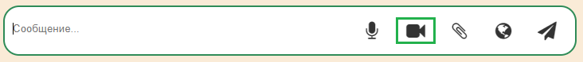
   * Запись аудио  
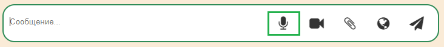
   * По окончанию записи нажать кнопку "Ок" 
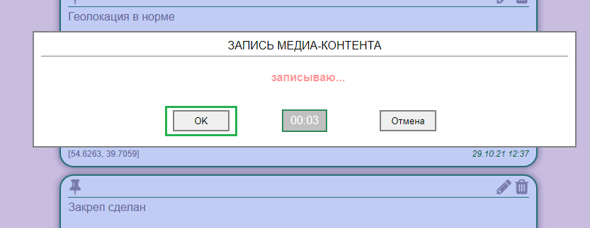
3. **Отправка геолокации**
   * Отправка осуществляется по нажатию кнопки  
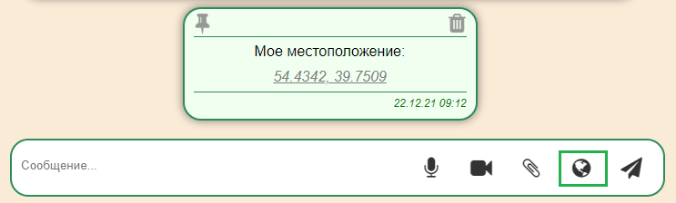
4. **Воспроизведение видео/аудио (используя API браузера)**
   * Воспроизведение видео/аудио осуществляется по нажатию кнопки "Play" 
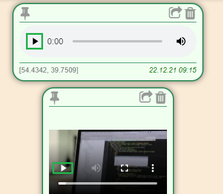
5. **Закрепление (pin) сообщений, закреплять можно только одно сообщение (прикрепляется к верхней части страницы):**
   * Сообщение закрепляется с помощью кнопки  
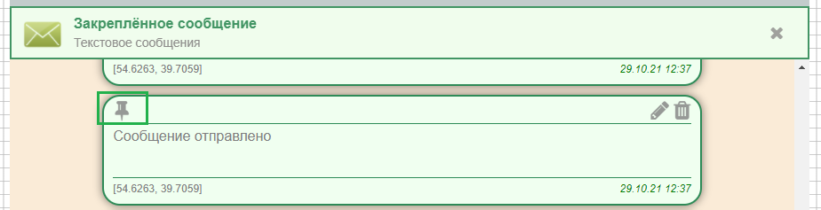